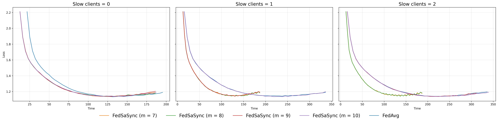
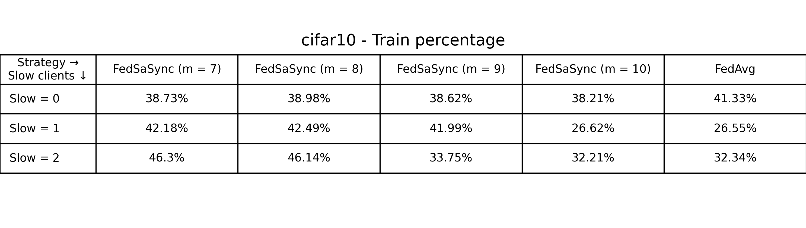
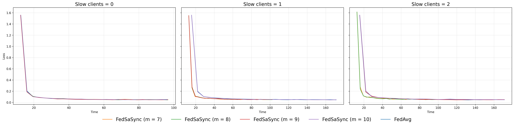

```bash
# At anypoint during the process of creating your baseline you can 
# run the formatting script. For this do:
cd .. # so you are in the `flower/baselines` directory

# Run the formatting script (it will auto-correct issues if possible)
./dev/format-baseline.sh baseline

# Then, if the above is all good, run the tests.
./dev/test-baseline.sh baseline
```

# FedSaSync: Semi-asynchronous Federated Learning in Flower

**Paper:** # TODO

**Authors:** Víctor Hidalgo-Izquierdo, Carmen Carrión, Blanca Caminero

**Abstract:** # TODO


## About this baseline

**What’s implemented:** The code in this directory is used to execute the experiments proposed in *Semi-asynchronous Federated Learning: An Extension of Flower and Performance Evaluation* (*REF*) for CIFAR10 and MNIST, which proposed the FedSaSync algorithm. Concretely, the results are exposed for both datasets in Figures *X* and *X* # TODO

**Datasets:** CIFAR10, MNIST

**Hardware Setup:** These experiments were run on a desktop machine with an 12th Gen Intel(R) Core(TM) i7-12700 (20 CPU threads). Any machine with with 4 CPU cores or more would be able to run it in a reasonable amount of time. Note: the entire experiment runs on a CPU-only mode, but GPU support is included on code.

**Contributors:** Víctor Hidalgo-Izquierdo, Carmen Carrión, Blanca Caminero


## Experimental Setup

**Task:** Image classification

**Model:** A PyTorch simple CNN adapted from 'PyTorch: A 60 Minute Blitz'. This is the model used by default in Flower. Note: The model has been modified to adapt to each dataset input, as well as the lr (see `model.py`).

**Dataset:** This baseline includes both CIFAR10 and MNIST datasets. They are partitioned into 10 clients following an IID partitioning where all clients receive data drawn from the same underlying distribution, ensuring balanced and homogeneous data across clients.

| Dataset | # classes | # rounds | # partitions |     partitioning method     |  partition settings  |
| :------ | :------: | :-------: | :----------: | :-------------------------: | :------------------: |
| CIFAR10 |    10    |   50      |     10       |      IID Partitioning       |   Homogeneous data   |
|  MNIST  |    10    |   25      |     10       |      IID Partitioning       |   Homogeneous data   |

**Training Hyperparameters:** The following table shows the main hyperparameters for this baseline with their default value (i.e. the value used if you run `flwr run .` directly)

| Description             | Default Value                                      |
| -------------------     | -------------------------------------------------- |
| total clients           | 10                                                 |
| clients per round       | 10                                                 |
| client resources        | {'num_cpus': 2.0, 'num_gpus': 0.0}                 |
| strategy name           | FedSaSync                                          |
| number of rounds        | 50                                                 |
| slow clients            | 0                                                  |
| semiasynchronous degree | 10                                                 |
| dataset name            | "uoft-cs/cifar10"                                  |
| learning rate           | 0.01                                               |

**Experiment configurations:** The following table shows the configurations to be used on the experiments, defined in `run_cifar10_experiments.sh` and `run_mnist_experiments.sh` (these configurations will later overwrite the default values with the `--run-config` option during `flwr run .`)
| dataset name     | slow clients  | semiasynchronous degree | number of rounds                  | learning rate                     |
| ---------------- | ------------- | ----------------------- | --------------------------------- | --------------------------------- |
| {CIFAR10, MNIST} | {0, 1, 2}     | {7, 8, 9, 10, FedAvg}   | *fixed according to the experiment* | *fixed according to the experiment* |

Note: `number of rounds` is 50 for CIFAR10, and 25 for MNIST; `learning rate` is 0.01 for CIFAR10, and 0.05 for MNIST

## Environment Setup

To construct the Python environment, simply run:

```bash
# Create the virtual environment
pyenv virtualenv 3.12.12 FedSaSync

# Activate it
pyenv activate FedSaSync

# Install the baseline
pip install -e .
```

## Running the Experiments

To run this FedSaSync, first ensure that your environment is properly activated as described above. For unique executions, do the following:

```bash
flwr run .  # this will run using the default settings in the `pyproject.toml`

# you can override settings directly from the command line
flwr run . --run-config "name='FedAvg' number-slow=1"   # for FedAvg with 1 slow client
# for FedSaSync with 2 slow clients, semiasync degree 8, mnist dataset
flwr run . --run-config "num-server-rounds=25 semiasync-deg=8 number-slow=2 dataset-name='ylecun/mnist'"    
```

The baseline includes the scripts `run_cifar10_experiments.sh` and `run_mnist_experiments.sh`, which are designed to execute the experiments reported in the paper using the predefined configurations. The configurations are described on the table below, at Experimental Setup:

```bash
bash run_cifar10_experiments.sh # CIFAR10
bash run_mnist_experiments.sh   # MNIST
```

We include a python script to automatically print several graphs to summarise the executions (see `_static/graphing.py`). Depending on the experiments performed, change the global configuration to define what will be printed on the plots. All results are saved in `_static`. Each experiment generates two visualizations: a comparative plot grouped by the number of slow clients to analyze the impact of different semi-asynchronous degrees, and a summary table showing the mean training percentage under each configuration and its effect on effective training time. To generate these visualizations, proceed as follows:

```bash
python _static/graphing.py  # Plot the results after executing
```

Results for CIFAR10:




Results for MNIST:



